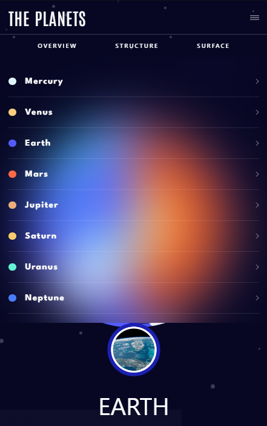

# Planets-Fact-Site

## [Design(Figma)](https://www.figma.com/file/cK01u0ixdKe2K8ezCz21YQ/planets-fact-site?type=design&node-id=0-1&t=09Jrypmuh8gKS4JO-0)

## [Live URL](https://planets-fact-site-eosin.vercel.app)

## Technologies Used

- Vite
- React
- React Router
- TypeScript
- Tailwind CSS
- Vercel (for deployment)

## Getting Started

To get a local copy of the project up and running, follow these steps:

1.  Clone the repository:

    ```shell
    git clone https://github.com/TemuriTsutskiridze/Planets-Fact-Site.git
    ```

2.  Install the dependencies:

    ```shell
    cd project-name
    npm install
    ```

## Design Preview



